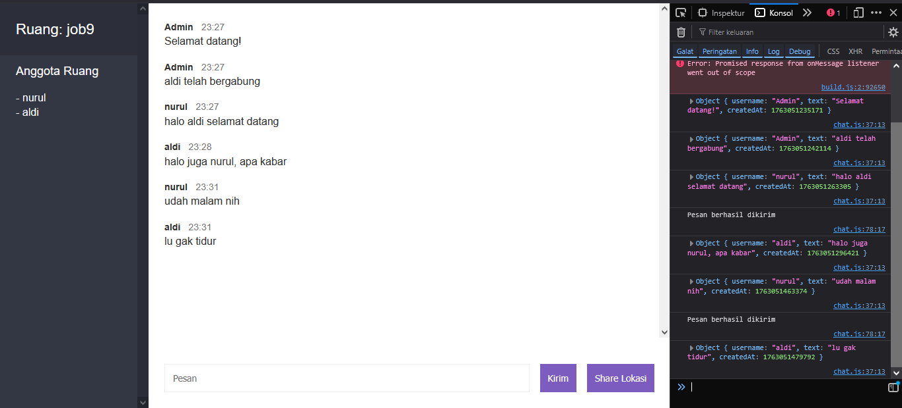

# TUGAS

1,
Jelaskan dengan disertai penjelasan baris kode terkait perbedaan fungsi socket.on yang ada pada file index.js di folder src dan file chat.js pada folder public/js!

### Penjelasan Perbedaan `socket.on` pada `index.js` dan `chat.js`

Pada file `index.js` di folder `src`, fungsi `socket.on` digunakan untuk menangani berbagai event yang diterima dari klien. Berikut adalah beberapa contoh:

1. **Event `join`**
   - Baris kode
     ```javascript
     socket.on('join', (options, callback) => {
         const { error, user } = tambahPengguna({ id: socket.id, ...options });
         if (error) {
             return callback(error);
         }
         socket.join(user.room);
         socket.emit('pesan', generateMessage('Admin', 'Selamat datang!'));
         socket.broadcast.to(user.room).emit('pesan',
             generateMessage('Admin', `${user.username} telah bergabung`)
         );
         io.to(user.room).emit('roomData', {
             room: user.room,
             users: ambilPenggunaDariRoom(user.room)
         });
         callback();
     });
     ```
   -  Event ini menangani ketika pengguna bergabung ke dalam room tertentu. Server akan mengirim pesan selamat datang kepada pengguna tersebut dan memberi tahu pengguna lain di room yang sama.

2. **Event `kirimPesan`**
   - Baris kode
     ```javascript
     socket.on('kirimPesan', (pesan, callback) => {
         const user = ambilPengguna(socket.id);
         const filter = new Filter();
         if (filter.isProfane(pesan)) {
             return callback('Pesan tidak boleh mengandung kata kasar');
         }
         io.to(user.room).emit('pesan', generateMessage(user.username, pesan));
         callback();
     });
     ```
   - Event ini menangani pengiriman pesan dari klien. Pesan akan difilter untuk memastikan tidak mengandung kata kasar sebelum diteruskan ke semua pengguna di room yang sama.

Pada file `chat.js` di folder `public/js`, fungsi `socket.on` digunakan untuk menangani event yang dikirim oleh server ke klien. Berikut adalah beberapa contoh:

1. **Event `pesan`**
   - Baris kode:
     ```javascript
     socket.on('pesan', (message) => {
         console.log(message);
         const html = Mustache.render(messageTemplate, {
             username: message.username,
             message: message.text,
             createdAt: moment(message.createdAt).format('H:mm')
         });
         $messages.insertAdjacentHTML('beforeend', html);
         autoScroll();
     });
     ```
   - Penjelasan: Event ini menangani pesan yang diterima dari server. Pesan tersebut akan dirender menggunakan template HTML dan ditampilkan di area chat.

2. **Event `locationMessage`**
   - Baris kode:
     ```javascript
     socket.on('locationMessage', (message) => {
         console.log(message);
         const html = Mustache.render(locationMessageTemplate, {
             username: message.username,
             url: message.url,
             createdAt: moment(message.createdAt).format('H:mm')
         });
         $messages.insertAdjacentHTML('beforeend', html);
     });
     ```
   - Penjelasan: Event ini menangani pesan lokasi yang diterima dari server. Pesan tersebut akan dirender menggunakan template HTML dan ditampilkan sebagai tautan peta.

### Perbedaan Utama
- **Lokasi Eksekusi**: 
  - `index.js` menangani event di sisi server.
  - `chat.js` menangani event di sisi klien.
- **Tujuan**:
  - `index.js` bertugas mengelola logika utama seperti bergabung ke room, memproses pesan, dan mengelola pengguna.
  - `chat.js` bertugas menampilkan data yang diterima dari server ke antarmuka pengguna.

---

2,
Pada saat anda melakukan proses chat seperti pada langkah 12 dan 13. Bukalah inspect pada browser anda. Lalu bukalah menu console. Lakukanlah proses chat dan investigasi apa yang ditampilkan pada console tersebut. Uraikan penjelasan anda dengan mengaitkannya ke baris kode yang menurut anda berhubungan dengan hal tersebut!




Pada saat proses chat dilakukan, berikut adalah beberapa hal yang ditampilkan pada console

1. **Pesan yang diterima dari server**
   - Baris kode terkait
     ```javascript
     socket.on('pesan', (message) => {
         console.log(message);
         const html = Mustache.render(messageTemplate, {
             username: message.username,
             message: message.text,
             createdAt: moment(message.createdAt).format('H:mm')
         });
         $messages.insertAdjacentHTML('beforeend', html);
         autoScroll();
     });
     ```
   - Pesan yang dikirim oleh pengguna lain atau server ditampilkan di console dalam bentuk objek yang berisi `username`, `text`, dan `createdAt`. Objek ini kemudian dirender ke dalam HTML untuk ditampilkan di area chat.

2. **Pesan berhasil dikirim**
   - Baris kode terkait:
     ```javascript
     socket.emit('kirimPesan', pesan, (error) => {
         // ...existing code...
         console.log('Pesan berhasil dikirim');
     });
     ```
   - Setelah pengguna mengirim pesan, pesan tersebut dikirim ke server menggunakan `socket.emit`. Jika berhasil, pesan "Pesan berhasil dikirim" ditampilkan di console.

---

3,
Pada file chat.html dibagian akhir pada baris kode `<script>` terdapat penggunaan library mustache, moment dan qs. Jelaskan bagaimana ketiga library ini berfungsi dalam aplikasi yang anda buat, kaitkanlah dengan baris kode yang menurut anda berhubungan!

### Penjelasan Fungsi Library Mustache, Moment, dan Qs

1. **Mustache**
   - Baris kode terkait
     ```javascript
     const html = Mustache.render(messageTemplate, {
         username: message.username,
         message: message.text,
         createdAt: moment(message.createdAt).format('H:mm')
     });
     ```
   - Library ini digunakan untuk merender template HTML dengan data dinamis, seperti `username`, `message`, dan `createdAt`, sehingga pesan dapat ditampilkan dengan format yang sesuai.

2. **Moment**
   - Baris kode terkait
     ```javascript
     moment(message.createdAt).format('H:mm')
     ```
   - Library ini digunakan untuk memformat waktu (timestamp) menjadi format yang lebih mudah dibaca, seperti jam dan menit.

3. **Qs**
   - Baris kode terkait
     ```javascript
     const { username, room } = Qs.parse(location.search, { ignoreQueryPrefix: true });
     ```
   - Library ini digunakan untuk memparsing query string dari URL, seperti `username` dan `room`, sehingga data dapat digunakan untuk bergabung ke room tertentu.

---

4,
Bukalah chat.js, dan perhatikan bahwa ada beberapa baris kode yang telah ditandai dengan komentar elements, templates dan options. Jelaskan baris kode tersebut dan bagaimana kode tersebut berhubungan dengan file chat.html dan file index.html!

### Penjelasan Kode dengan Komentar Elements, Templates, dan Options

1. **Elements**
   - Baris kode terkait
     ```javascript
     const $messageForm = document.querySelector('#form-pesan');
     const $messageFormInput = document.querySelector('input');
     const $messageFormButton = document.querySelector('button');
     const $sendLocationButton = document.querySelector('#kirim-lokasi');
     const $messages = document.querySelector('#messages');
     ```
   - Kode ini berfungsi untuk mengambil elemen-elemen HTML dari file `chat.html`, seperti form pesan, tombol kirim lokasi, dan area pesan. Elemen-elemen ini digunakan untuk interaksi pengguna, seperti mengirim pesan atau lokasi.

2. **Templates**
   - Baris kode terkait
     ```javascript
     const messageTemplate = document.querySelector('#message-template').innerHTML;
     const locationMessageTemplate = document.querySelector('#locationMessage-template').innerHTML;
     const sidebarTemplate = document.querySelector('#sidebar-template').innerHTML;
     ```
   - Kode ini mengambil template HTML dari file `chat.html`. Template ini digunakan untuk merender pesan, lokasi, dan sidebar dengan data dinamis yang diterima dari server.

3. **Options**
   - Baris kode terkait
     ```javascript
     const { username, room } = Qs.parse(location.search, { ignoreQueryPrefix: true });
     ```
   - Kode ini memparsing query string dari URL di file `index.html` untuk mendapatkan data `username` dan `room`. Data ini digunakan untuk bergabung ke room tertentu saat aplikasi dimulai.

### Hubungan dengan File `chat.html` dan `index.html`
- **File `chat.html`**: Elemen dan template yang diambil dari file ini digunakan untuk interaksi pengguna dan tampilan data, seperti pesan dan lokasi.
- **File `index.html`**: Query string dari URL di file ini menyediakan data `username` dan `room` yang digunakan untuk mengatur koneksi ke room tertentu.

---

5,
Jelaskan fungsi file messages.js dan users.js dan bagaimana baris kode pada kedua file ini terhubung dengan index.js, chat.js dan kedua file html (chat.html dan index.html)

### Penjelasan Fungsi File `messages.js` dan `users.js`

1. **File `messages.js`**
   - File ini berisi fungsi untuk membuat objek pesan dan pesan lokasi.
   - Baris kode terkait
     ```javascript
     const generateMessage = (username, text) => {
         return {
             username,
             text,
             createdAt: new Date().getTime()
         };
     };
     ```
     ```javascript
     const generateLocationMessage = (username, url) => {
         return {
             username,
             url,
             createdAt: new Date().getTime()
         };
     };
     ```   
    - Digunakan di `index.js` untuk membuat pesan yang dikirim ke klien.
    - Pesan ini ditampilkan di `chat.js` menggunakan template dari `chat.html`.

2. **File `users.js`**
   - File ini berisi fungsi untuk mengelola data pengguna, seperti menambah, menghapus, dan mengambil pengguna.
   - Baris kode terkait
     ```javascript
     const tambahPengguna = ({ id, username, room }) => {
         // ...existing code...
     };
     ```
     ```javascript
     const ambilPengguna = (id) => {
         return users.find((user) => user.id === id);
     };
     ```
    - Digunakan di `index.js` untuk mengelola pengguna yang bergabung atau keluar dari room.
    - Data pengguna ditampilkan di sidebar melalui `chat.js` dan `chat.html`.

### Hubungan dengan File HTML
- **File `chat.html`**: Pesan dan data pengguna yang dihasilkan oleh `messages.js` dan `users.js` dirender ke elemen HTML untuk ditampilkan.
- **File `index.html`**: Data pengguna dari `users.js` digunakan untuk mengatur koneksi ke room tertentu berdasarkan query string.

---

6,
Bagaimana aplikasi ini bisa mengirimkan lokasi? Jelaskan apa yang terjadi dengan disertai penjelasan baris kode!

### Penjelasan Pengiriman Lokasi

Aplikasi ini dapat mengirimkan lokasi dengan memanfaatkan fitur Geolocation API pada browser dan socket.io untuk komunikasi real-time. Berikut adalah alur dan baris kode yang terlibat:

1. **Mengambil Lokasi Pengguna**
   - Baris kode terkait
     ```javascript
     navigator.geolocation.getCurrentPosition((position) => {
         socket.emit('kirimLokasi', {
             latitude: position.coords.latitude,
             longitude: position.coords.longitude
         }, () => {
             $sendLocationButton.removeAttribute('disabled');
             console.log('Lokasi berhasil dikirim');
         });
     });
     ```
   - Browser mengambil koordinat lokasi pengguna (latitude dan longitude) menggunakan `navigator.geolocation.getCurrentPosition`.

2. **Mengirim Lokasi ke Server**
   - Baris kode terkait
     ```javascript
     socket.emit('kirimLokasi', {
         latitude: position.coords.latitude,
         longitude: position.coords.longitude
     }, callback);
     ```
   - Lokasi dikirim ke server melalui event `kirimLokasi` menggunakan `socket.emit`.

3. **Server Menyebarkan Lokasi ke Klien Lain**
   - Baris kode terkait
     ```javascript
     socket.on('kirimLokasi', (coords, callback) => {
         const user = ambilPengguna(socket.id);
         io.to(user.room).emit('locationMessage',
             generateLocationMessage(user.username,
                 `https://www.google.com/maps?q=${coords.latitude},${coords.longitude}`)
         );
         callback();
     });
     ```
   - Server menerima lokasi, membuat pesan lokasi menggunakan `generateLocationMessage`, dan menyebarkannya ke semua pengguna di room yang sama.

4. **Menampilkan Lokasi di Klien**
   - Baris kode terkait
     ```javascript
     socket.on('locationMessage', (message) => {
         const html = Mustache.render(locationMessageTemplate, {
             username: message.username,
             url: message.url,
             createdAt: moment(message.createdAt).format('H:mm')
         });
         $messages.insertAdjacentHTML('beforeend', html);
     });
     ```
   - Klien menerima pesan lokasi dari server, merendernya menggunakan template HTML, dan menampilkannya sebagai tautan peta di area chat.

---

7,
Kenapa aplikasi ini dijalankan menggunakan perintah npm run dev bukan menggunakan perintah node diikuti nama file seperti pada jobsheet-jobsheet sebelumnya? Coba juga jalankan aplikasi menggunakan perintah npm run start, investigasi apa yang terjadi dan apa
yang membedakannya dengan npm run dev?

### Penjelasan Perintah `npm run dev` dan `npm run start`

1. **Kenapa menggunakan `npm run dev`?**
   - Perintah `npm run dev` digunakan untuk menjalankan aplikasi dalam mode pengembangan. Mode ini biasanya menggunakan library seperti `nodemon` yang secara otomatis me-restart server setiap kali ada perubahan pada kode.
   - Baris kode terkait:
     ```json
     "scripts": {
         "dev": "nodemon src/index.js"
     }
     ```
   - Penjelasan: `nodemon` mempermudah pengembangan dengan mendeteksi perubahan file secara otomatis.

2. **Investigasi `npm run start`**
   - Perintah `npm run start` digunakan untuk menjalankan aplikasi dalam mode produksi.
   - Baris kode terkait:
     ```json
     "scripts": {
         "start": "node src/index.js"
     }
     ```
   - Penjelasan: Mode ini menggunakan `node` tanpa fitur tambahan seperti auto-restart, sehingga lebih cocok untuk lingkungan produksi.

3. **Perbedaan `npm run dev` dan `npm run start`**
   - **`npm run dev`**: Cocok untuk pengembangan karena mendukung auto-restart dengan `nodemon`.
   - **`npm run start`**: Cocok untuk produksi karena lebih ringan dan tidak memerlukan fitur auto-restart.

---

8.
Selain socket.on, fungsi socket apa lagi yang digunakan dalam aplikasi ini. Silakan telusuri dan jelaskan pendapat anda disertai dengan baris kode!

### Fungsi Socket Selain `socket.on`

1. **`socket.emit`**
   - Baris kode terkait
     ```javascript
     socket.emit('kirimPesan', pesan, (error) => {
         console.log('Pesan berhasil dikirim');
     });
     ```
     ```javascript
     socket.emit('kirimLokasi', {
         latitude: position.coords.latitude,
         longitude: position.coords.longitude
     }, () => {
         console.log('Lokasi berhasil dikirim');
     });
     ```
   - Fungsi ini digunakan untuk mengirim data dari klien ke server, seperti pesan teks dan lokasi.

2. **`socket.broadcast`**
   - Baris kode terkait
     ```javascript
     socket.broadcast.to(user.room).emit('pesan',
         generateMessage('Admin', `${user.username} telah bergabung`)
     );
     ```
   - Fungsi ini digunakan untuk mengirim data ke semua klien di room tertentu, kecuali pengirim.

3. **`socket.join`**
   - Baris kode terkait:
     ```javascript
     socket.join(user.room);
     ```
   - Fungsi ini digunakan untuk memasukkan klien ke dalam room tertentu.

---

9,
Jelaskan terkait ini real-time bidirectional event-based communication disertai penjelasan baris kode sesuai aplikasi yang anda buat!

### Penjelasan Real-Time Bidirectional Event-Based Communication

Real-time bidirectional event-based communication memungkinkan klien dan server untuk saling bertukar data secara langsung dan terus-menerus tanpa perlu melakukan permintaan HTTP berulang kali. Dalam aplikasi ini, komunikasi ini diimplementasikan menggunakan library `socket.io`. Berikut adalah penjelasan dengan baris kode:

1. **Server Mengirim dan Menerima Event**
   - Baris kode terkait
     ```javascript
     socket.on('join', (options, callback) => {
         socket.join(user.room);
         socket.emit('pesan', generateMessage('Admin', 'Selamat datang!'));
         socket.broadcast.to(user.room).emit('pesan',
             generateMessage('Admin', `${user.username} telah bergabung`)
         );
     });
     ```
   - Server menerima event `join` dari klien, lalu mengirim pesan ke pengguna tertentu menggunakan `socket.emit` dan ke semua pengguna lain di room menggunakan `socket.broadcast.to`.

2. **Klien Mengirim dan Menerima Event**
   - Baris kode terkait
     ```javascript
     socket.emit('kirimPesan', pesan, (error) => {
         console.log('Pesan berhasil dikirim');
     });

     socket.on('pesan', (message) => {
         const html = Mustache.render(messageTemplate, {
             username: message.username,
             message: message.text,
             createdAt: moment(message.createdAt).format('H:mm')
         });
         $messages.insertAdjacentHTML('beforeend', html);
     });
     ```
   - Klien mengirim pesan ke server menggunakan `socket.emit`. Pesan yang diterima dari server dirender ke antarmuka pengguna menggunakan template HTML.

3. **Real-Time Updates**
   - Baris kode terkait
     ```javascript
     io.to(user.room).emit('roomData', {
         room: user.room,
         users: ambilPenggunaDariRoom(user.room)
     });
     ```
   - Server mengirimkan pembaruan data room secara real-time ke semua pengguna di room tertentu menggunakan `io.to().emit`.

Dengan pendekatan ini, aplikasi dapat memberikan pengalaman komunikasi yang cepat dan responsif kepada pengguna.


